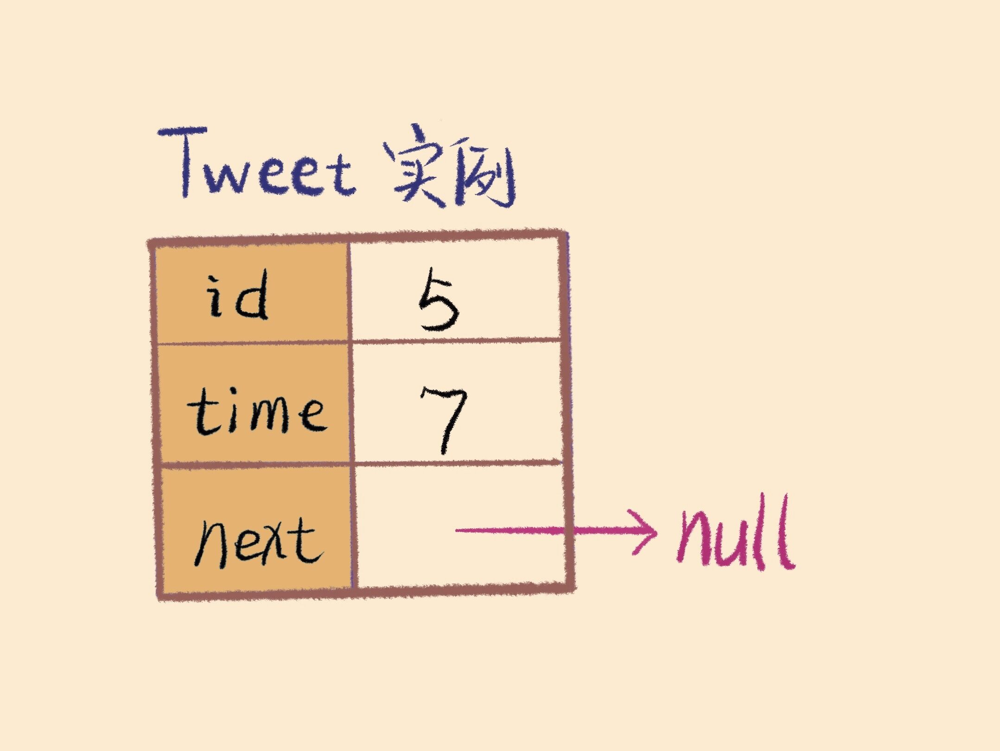
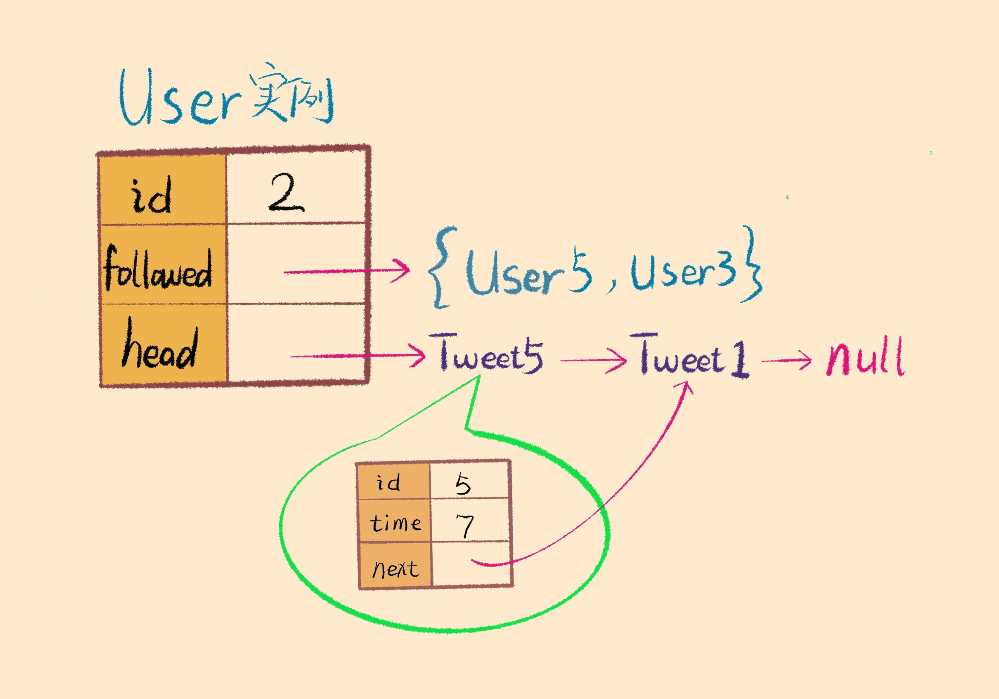

# 355.设计推特

设计一个简化版的推特(Twitter)，可以让用户实现发送推文，关注/取消关注其他用户，能够看见关注人（包括自己）的最近十条推文。你的设计需要支持以下的几个功能：

1. `postTweet(userId, tweetId):` 创建一条新的推文
2. `getNewsFeed(userId):` 检索最近的十条推文。每个推文都必须是由此用户关注的人或者是用户自己发出的。推文必须按照时间顺序由最近的开始排序。
3. `follow(followerId, followeeId):` 关注一个用户
4. `unfollow(followerId, followeeId):` 取消关注一个用户
示例:
```
Twitter twitter = new Twitter();

// 用户1发送了一条新推文 (用户id = 1, 推文id = 5).
twitter.postTweet(1, 5);

// 用户1的获取推文应当返回一个列表，其中包含一个id为5的推文.
twitter.getNewsFeed(1);

// 用户1关注了用户2.
twitter.follow(1, 2);

// 用户2发送了一个新推文 (推文id = 6).
twitter.postTweet(2, 6);

// 用户1的获取推文应当返回一个列表，其中包含两个推文，id分别为 -> [6, 5].
// 推文id6应当在推文id5之前，因为它是在5之后发送的.
twitter.getNewsFeed(1);

// 用户1取消关注了用户2.
twitter.unfollow(1, 2);

// 用户1的获取推文应当返回一个列表，其中包含一个id为5的推文.
// 因为用户1已经不再关注用户2.
twitter.getNewsFeed(1);
```

该题是一道非常有趣的OOP(面向对象)设计问题，将合并多个有序链表算法和OO design结合起来了，非常考察解题者的设计能力。

[参考题解](https://leetcode-cn.com/problems/design-twitter/solution/mian-xiang-dui-xiang-she-ji-he-bing-k-ge-you-xu-li/)

该题主要涉及两个对象: tweet(推文)、user(用户)。推文和用户都用id进行标识，首先需要对这两个对象进行抽象：

__1.Tweet类抽象__  
根据题目的分析，每个Tweet实例需要记录自己的 tweetId 和发表时间 time，而且作为链表节点，要有一个指向下一个节点的 next 指针。


```java
class Tweet {
    private int id;
    private int time;
    private Tweet next;

    // 需要传入推文内容（id）和发文时间
    public Tweet(int id, int time) {
        this.id = id;
        this.time = time;
        this.next = null;
    }
}
```

__2.User类抽象__  
一个用户需要存储的信息有 userId，关注列表，以及该用户发过的推文列表。其中关注列表应该用集合（Hash Set）这种数据结构来存，因为不能重复，而且需要快速查找；推文列表应该由链表这种数据结构储存，以便于进行有序合并的操作。

```java
// static int timestamp = 0
class User {
    private int id;
    public Set<Integer> followed;
    // 用户发表的推文链表头结点
    public Tweet head;

    public User(int userId) {
        followed = new HashSet<>();
        this.id = userId;
        this.head = null;
        // 关注一下自己
        follow(id);
    }

    public void follow(int userId) {
        followed.add(userId);
    }

    public void unfollow(int userId) {
        // 不可以取关自己
        if (userId != this.id)
            followed.remove(userId);
    }

    public void post(int tweetId) {
        Tweet twt = new Tweet(tweetId, timestamp);
        timestamp++;
        // 将新建的推文插入链表头
        // 越靠前的推文 time 值越大
        twt.next = head;
        head = twt;
    }
}
```
__3.API实现__
```JAVA
class Twitter {
    private static int timestamp = 0;
    private static class Tweet {...}
    private static class User {...}

    // 我们需要一个映射将 userId 和 User 对象对应起来
    private HashMap<Integer, User> userMap = new HashMap<>();

    /** user 发表一条 tweet 动态 */
    public void postTweet(int userId, int tweetId) {
        // 若 userId 不存在，则新建
        if (!userMap.containsKey(userId))
            userMap.put(userId, new User(userId));
        User u = userMap.get(userId);
        u.post(tweetId);
    }
    
    /** follower 关注 followee */
    public void follow(int followerId, int followeeId) {
        // 若 follower 不存在，则新建
		if(!userMap.containsKey(followerId)){
			User u = new User(followerId);
			userMap.put(followerId, u);
		}
        // 若 followee 不存在，则新建
		if(!userMap.containsKey(followeeId)){
			User u = new User(followeeId);
			userMap.put(followeeId, u);
		}
		userMap.get(followerId).follow(followeeId);
    }
    
    /** follower 取关 followee，如果 Id 不存在则什么都不做 */
    public void unfollow(int followerId, int followeeId) {
        if (userMap.containsKey(followerId)) {
            User flwer = userMap.get(followerId);
            flwer.unfollow(followeeId);
        }
    }

    /** 返回该 user 关注的人（包括他自己）最近的动态 id，
    最多 10 条，而且这些动态必须按从新到旧的时间线顺序排列。*/
    public List<Integer> getNewsFeed(int userId) {
        // 需要理解算法，见下文
    }
}
```
__4.获取最新推文算法设计__

将对应用户的推文以及其关注人的推文都放到优先级队列中按照时间排序，使得最新的推文在队列头部，然后遍历队列，取出前10的推文即可。


```JAVA
public List<Integer> getNewsFeed(int userId) {
    List<Integer> res = new ArrayList<>();
    if (!userMap.containsKey(userId)) return res;
    // 关注列表的用户 Id
    Set<Integer> users = userMap.get(userId).followed;
    // 自动通过 time 属性从大到小排序，容量为 users 的大小
    PriorityQueue<Tweet> pq = 
        new PriorityQueue<>(users.size(), (a, b)->(b.time - a.time));

    // 先将所有链表头节点插入优先级队列
    for (int id : users) {
        Tweet twt = userMap.get(id).head;
        if (twt == null) continue;
        pq.add(twt);
    }

    while (!pq.isEmpty()) {
        // 最多返回 10 条就够了
        if (res.size() == 10) break;
        // 弹出 time 值最大的（最近发表的）
        Tweet twt = pq.poll();
        res.add(twt.id);
        // 将下一篇 Tweet 插入进行排序
        if (twt.next != null) 
            pq.add(twt.next);
    }
    return res;
}
```

