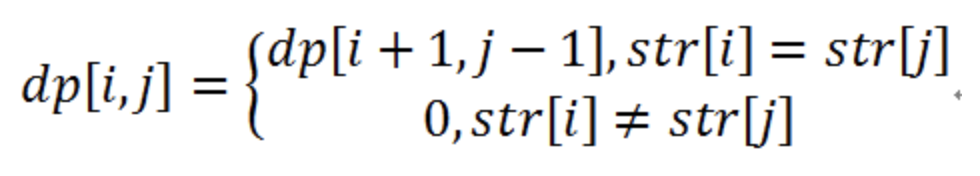
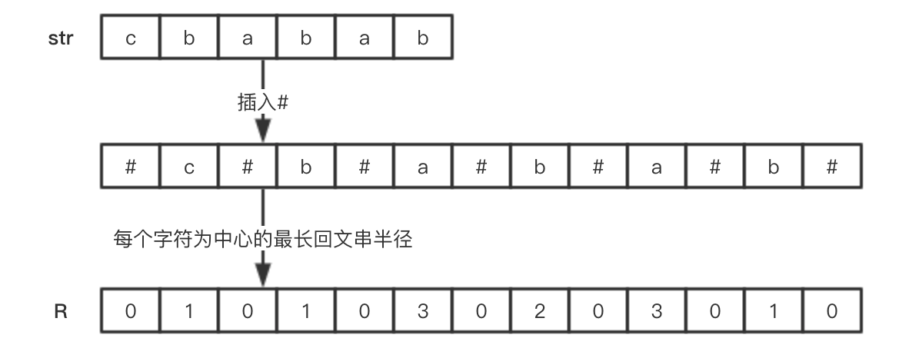

# 5.最长回文子串
给定一个字符串 s，找到 s 中最长的回文子串。你可以假设 s 的最大长度为 1000。

示例 1：
```
输入: "babad"
输出: "bab"
注意: "aba" 也是一个有效答案。
```
示例 2：
```
输入: "cbbd"
输出: "bb"
```

### 方法1：中心点扩散法
思路：把给定的字符串的每一个字符当做中心，向两边扩展，找到最长的回文子串。
```java
class Solution {
    public String longestPalindrome(String s) {
        // 插入字符构建新字符串
        StringBuilder sb = new StringBuilder("#");
        for (int i = 0; i < s.length(); i++)
            sb.append(s.charAt(i)).append("#");
        int len = sb.length();
        String result = "";
        for (int i = 0; i < len; i++){
            // 以i为中心进行左右扩展
            int left = i, right = i;
            while (left - 1 >= 0 && right + 1 < len && sb.charAt(left - 1) == sb.charAt(right + 1)){
                left--;
                right++;
            }
            // 更新最长回文串
            if (result.length() < right - left + 1){
                result = sb.substring(left, right);
            }
        }

        return result.replaceAll("#","");
    }
}
```
时间复杂度：O(n^2)
### 方法2：DP(动态规划)
对于字符串str，假设dp[i,j]=1表示str[i...j]是回文子串，那个必定存在dp[i+1,j-1]=1。这样最长回文子串就能分解成一系列子问题，可以利用动态规划求解了。首先构造状态转移方程:



```java
class Solution {
    public String longestPalindrome(String s) {
        if (s == null || s.length() == 1) return s;
        String res = "";
        int maxLen = 0;
        boolean[][] dp = new boolean[s.length()][s.length()];
        for (int j = 0; j < s.length(); j++){
            for (int i = 0; i <= j; i++){
                dp[i][j] = s.charAt(i) == s.charAt(j) && ((j - i <= 2) || dp[i + 1][j - 1]);
                if (dp[i][j]){
                    if (j - i + 1 > maxLen){
                        maxLen = j - i + 1;
                        res = s.substring(i, j + 1);
                    }
                }
            }
        }
        return res;
    }
}
```
时间复杂度：O(n^2)
### 方法3：Manacher算法(马拉车)
该算法首先通过插入特殊字符将长度为奇数的回文串和长度为偶数的回文串一起考虑。然后计算每个字符为中心的最长回文半径数组R，然后得到最长回文串的中心下标和对应的半径，最终拿到最长的回文字符串。


#### 算法流程：
1. 插入分隔符'#'以及首尾防下标越界字符'^'和'$'
2. 获取以i为中心进行扩展的回文子串半径R[i]:
    * i < maxRight : 当前遍历的字符串包含在之前寻找的最长回文串里面，此时以i为中心的已知最长回文串半径则从如下两者取较小的：
        * maxRight - i： 由于maxRight > i，说明i对应的字符在之前最长回文串中
        * R[mirrorIndex]： i相对于之前最长回文串中心curCenter的镜像mirrorIndex为中心的已知最长回文串半径 R[mirrorIndex]
    * i >= maxRight :当前遍历的字符串不包含在之前寻找的最长回文串里面，因此R[i]为0
3. 基于当前下标i为中心进行扩展寻找回文串，并更新R[i]
4. 更新当前最长回文串的右边界下标maxRight以及中心下标curCenter
5. 更新最大回文半径maxR与中心点maxCenter
6. 根据maxCenter和maxR计算回文串开始下标startIndex，再根据maxR，获取最长回文串。

```java
class Solution {
    public String longestPalindrome(String s) {
        // 插入字符'#'构建新字符串,头尾插入字符'^'和'$'防止下标访问越界
        StringBuilder sb = new StringBuilder("^");
        for (int i = 0; i < s.length(); i++) 
            sb.append("#").append(s.charAt(i));
        sb.append("#$");
        // curCenter：当前最大回文串中心 
        // maxRight: 当前最大回文串右边界
        // R：每个字符为中心扩展的最大回文串半径，eg. "cababad",R[3] = 2
        int curCenter = 0, maxRight = 0, maxCenter = 0;
        int len = sb.length(), maxR = 0;
        int []R = new int[len];
        //两边^$字符不遍历
        for (int i = 1; i < len - 1; i++){
            // 计算i相对curCenter的镜像位置
            int mirrorIndex = 2 * curCenter - i;
            // 计算已i为中心进行扩展的回文子串半径:
            // i < maxRight : 当前遍历的字符串包含在之前寻找的最长回文串里面，此时
            // 以i为中心的已知最长回文串半径则从如下两者取较小的：
            //    1. maxRight - i： 由于maxRight > i，说明i以及在之前最长回文串中
            //    2. R[mirrorIndex]： i相对于之前最长回文串中心curCenter的镜像mirrorIndex为中心的已知最长回文串半径 R[mirrorIndex]
            R[i] = maxRight > i ? Math.min(maxRight - i, R[mirrorIndex]) : 0;
            
            // 基于当前点为中心进行扩展寻找回文
            while (sb.charAt(i - 1 - R[i]) == sb.charAt(i + 1 + R[i]))
                R[i]++;
            
            // 若扩展的右边界值maxRight > 当前右边界值i+R[i]则更新
            if (R[i] + i > maxRight){
                curCenter = i;
                maxRight = R[i] + i;
            }
            
            // 更新最大回文半径与中心点
            if (R[i] > maxR){
                maxR = R[i];
                maxCenter = i;
            }
        }
        // 由于插入有'#'字符，因此index需要除以2
        int startIndex = (maxCenter - 1 - maxR)/2;        
        return s.substring(startIndex, startIndex + maxR);
    }
}
```
时间复杂度：O(n)