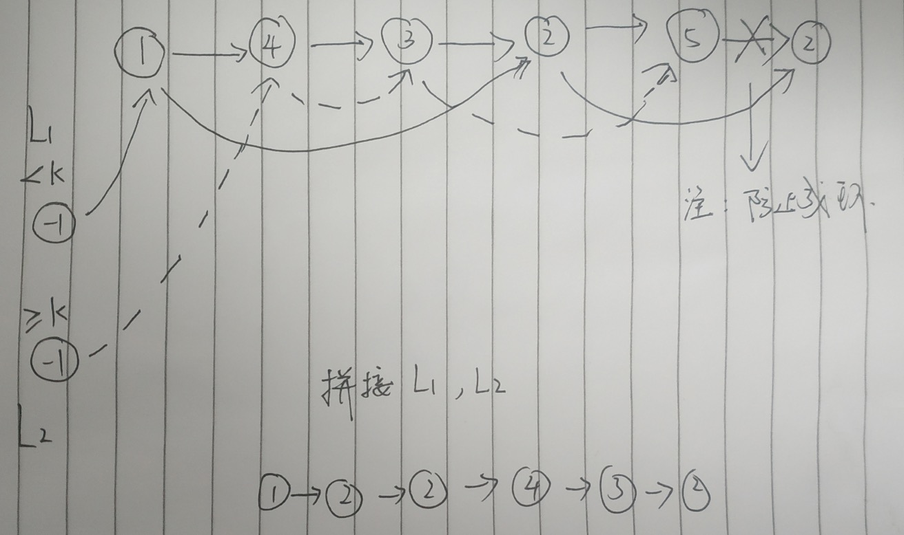

# 86.分隔链表

给定一个链表和一个特定值 x，对链表进行分隔，使得所有小于 x 的节点都在大于或等于 x 的节点之前。

你应当保留两个分区中每个节点的初始相对位置。

示例:
```
输入: head = 1->4->3->2->5->2, x = 3
输出: 1->2->2->4->3->5
```
**思路：** 通过遍历链表，将小于k和大于等于k的节点分别关联到两个链表中，最后进行拼接即可。


```java
/**
 * Definition for singly-linked list.
 * public class ListNode {
 *     int val;
 *     ListNode next;
 *     ListNode(int x) { val = x; }
 * }
 */
class Solution {
    public ListNode partition(ListNode head, int x) {
        if (head == null || head.next == null){
            return head;
        }
        ListNode p = head;
        ListNode p1 = new ListNode(-1), head1 = p1;
        ListNode p2 = new ListNode(-1), head2 = p2;
        
        while(p != null){
            if (p.val < x){
                p1.next = p;
                p1 = p1.next;
            }else{
                p2.next = p;
                p2 = p2.next;
            }
            p = p.next;
        }
        p2.next = null;
        p1.next = head2.next;
        return head1.next;
    }
}
```