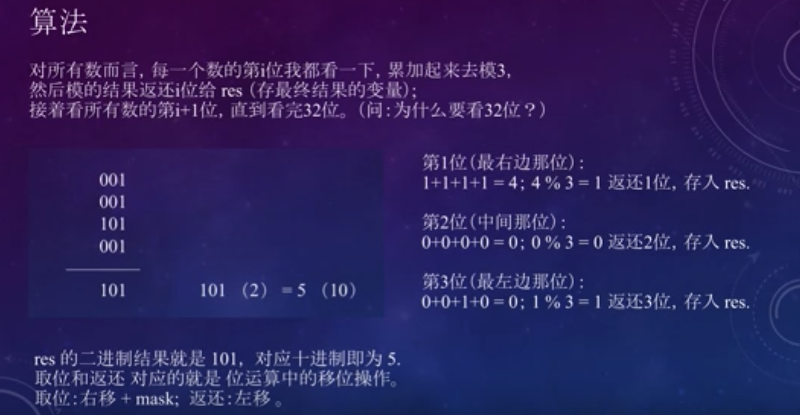

# 137.只出现一次的数字II

给定一个非空整数数组，除了某个元素只出现一次以外，其余每个元素均出现了三次。找出那个只出现了一次的元素。

说明：

你的算法应该具有线性时间复杂度。 你可以不使用额外空间来实现吗？

示例 1:
```
输入: [2,2,3,2]
输出: 3
```
示例 2:
```
输入: [0,1,0,1,0,1,99]
输出: 99
```

**思路：**


Code:
```java
class Solution {
    public int singleNumber(int[] nums) {
        /**
         * 001
         * 001
         * 101
         * 001
         * -----
         * 101 (5)
         */
        if (nums.length == 1) return nums[0];
        int res = 0;
        for (int i = 0; i < 32; i++){
            int sum = 0;
            for (int num : nums){
                // (num >> i) & 1: 取num的第i位
                sum += (num >> i) & 1;
            }
            // 对3取模
            sum %= 3;
            // 设置第i位为取模后的结果
            res = res | (sum << i);
        } 
        return res;
    }
}
```