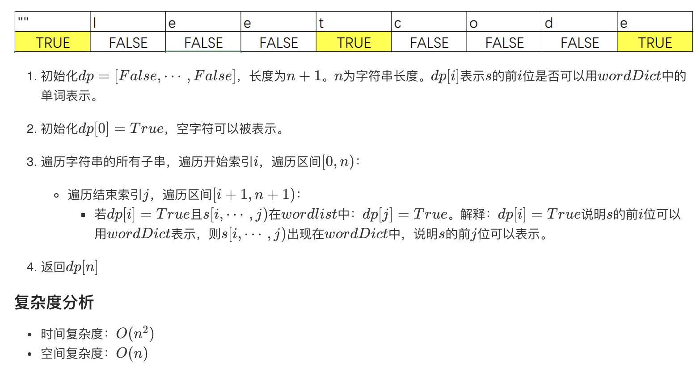

# 139.单词拆分

给定一个非空字符串 s 和一个包含非空单词列表的字典 wordDict，判定 s 是否可以被空格拆分为一个或多个在字典中出现的单词。

说明：

- 拆分时可以重复使用字典中的单词。
- 你可以假设字典中没有重复的单词。
  
示例 1：
```
输入: s = "leetcode", wordDict = ["leet", "code"]
输出: true
解释: 返回 true 因为 "leetcode" 可以被拆分成 "leet code"。
```
示例 2：
```
输入: s = "applepenapple", wordDict = ["apple", "pen"]
输出: true
解释: 返回 true 因为 "applepenapple" 可以被拆分成 "apple pen apple"。
     注意你可以重复使用字典中的单词。
```
示例 3：
```
输入: s = "catsandog", wordDict = ["cats", "dog", "sand", "and", "cat"]
输出: false
```
__思路:__


```java
class Solution {
    public boolean wordBreak(String s, List<String> wordDict) {
        int len = s.length();
        boolean[] dp = new boolean[len+1];
        dp[0] = true;
        for (int i = 1; i <= s.length(); i++){
            for (int j = 0; j < i; j++){
                if (dp[j] == true && wordDict.contains(s.substring(j,i))){
                    dp[i] = true;
                }
            }
        }
        return dp[len];
    }
}
```