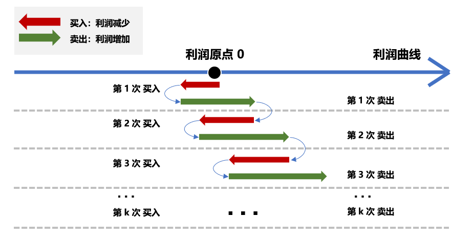

# 188. 买卖股票的最佳时机 IV

给定一个数组，它的第 i 个元素是一支给定的股票在第 i 天的价格。

设计一个算法来计算你所能获取的最大利润。你最多可以完成 k 笔交易。

注意: 你不能同时参与多笔交易（你必须在再次购买前出售掉之前的股票）。

示例 1:
```
输入: [3,2,6,5,0,3], k = 2
输出: 7
解释: 在第 2 天 (股票价格 = 2) 的时候买入，在第 3 天 (股票价格 = 6) 的时候卖出, 这笔交易所能获得利润 = 6-2 = 4 。
     随后，在第 5 天 (股票价格 = 0) 的时候买入，在第 6 天 (股票价格 = 3) 的时候卖出, 这笔交易所能获得利润 = 3-0 = 3 
```



Code:
```java
class Solution {
    public int maxProfit(int k, int[] prices) {
        if (k == 0) return 0;
        if(k >= prices.length/2) return greedy(prices);
        int[] dpBuy = new int[k];
        Arrays.fill(dpBuy, Integer.MIN_VALUE);
        int[] dpSell = new int[k];

        for (int i = 0; i < prices.length; i++){
            // 将次数推广到n次买卖
            for (int j = 0; j < k; j++){
                // 第一次买的时候 是0，其他的都是沿用上一次买卖的收益
                int pre = (j == 0) ? 0 : dpSell[j-1];
                // 将收益累计到下一次
                dpBuy[j] = Math.max(dpBuy[j], pre - prices[i]);
                dpSell[j] = Math.max(dpSell[j], dpBuy[j] + prices[i]);
            }
        }
        return dpSell[k-1];
    }

    private int greedy(int[] prices) {
        int max = 0;
        for(int i = 1; i < prices.length; ++i) {
            if(prices[i] > prices[i-1])
                max += prices[i] - prices[i-1];
        }
        return max;
    }
}
```