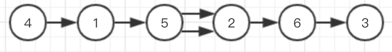
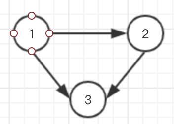

# 444.序列重建

验证原始的序列 org 是否可以从序列集 seqs 中唯一地重建。序列 org 是 1 到 n 整数的排列，其中 1 ≤ n ≤ 104。重建是指在序列集 seqs 中构建最短的公共超序列。（即使得所有  seqs 中的序列都是该最短序列的子序列）。确定是否只可以从 seqs 重建唯一的序列，且该序列就是 org 。

示例 1：
```
输入：
org: [1,2,3], seqs: [[1,2],[1,3]]

输出：
false

解释：
[1,2,3] 不是可以被重建的唯一的序列，因为 [1,3,2] 也是一个合法的序列。
```

示例 2：
```
输入：
org: [1,2,3], seqs: [[1,2]]

输出：
false

解释：
可以重建的序列只有 [1,2]。
```

示例 3：
```
输入：
org: [1,2,3], seqs: [[1,2],[1,3],[2,3]]

输出：
true

解释：
序列 [1,2], [1,3] 和 [2,3] 可以被唯一地重建为原始的序列 [1,2,3]。
```

示例 4：
```
输入：
org: [4,1,5,2,6,3], seqs: [[5,2,6,3],[4,1,5,2]]

输出：
true
```

__思路:__

1. 通过seqs序列，构建有向连通图，将每个序列中相邻点建立连接，例如
    ```
    [[5,2,6,3],[4,1,5,2]]
    ```
    
    [4,1,5,2,6,3]是唯一的重建序列
    ```
    [[1,2],[1,3],[2,3]]
    ```
    
     [1,2,3]是唯一的重建序列

2. 计算每个点的入度
3. 从入度为0的点进行拓扑序列，若存在多个入度为0的点，则返回false，表示不存在唯一的重建序列
4. 将遍历后的拓扑序列和重建序列进行比较，看是否相等，相等则返回true

```JAVA
class Solution {
    public boolean sequenceReconstruction(int[] org, List<List<Integer>> seqs) {
        int N = org.length;
        if (N == 0 || seqs.size() == 0) return false;
        int[] degree = new int[N+1];
        // 初始化邻接表
        List<List<Integer>> graph = new ArrayList<>();
        for (int i = 0; i <= N; i++) {
            graph.add(new ArrayList<>());
        }
        // 构建邻接表
        for (List<Integer> list : seqs){
            for (int i = 0; i < list.size() - 1; i++){
                graph.get(list.get(i)).add(list.get(i+1));
                degree[list.get(i+1)]++;
            }
        }
        Queue<Integer> queue = new LinkedList<>();
        for (int i = 1; i <= N; i++){
            if (degree[i] == 0){
                queue.offer(i);
            }
        }
        if (queue.isEmpty()) return false;
        int index = 0;
        while (!queue.isEmpty()){
            int cur = queue.poll();
            if (cur != org[index++])  return false;
            int nextDegreeZeroCount = 0;
            List<Integer> curList = graph.get(cur);
            for (Integer num : curList){
                degree[num]--;
                if (degree[num] == 0){
                    nextDegreeZeroCount++;
                    if (nextDegreeZeroCount > 1) return false;
                    queue.offer(num);
                }
            }
        }
        return index == N;
        
    }
}
```