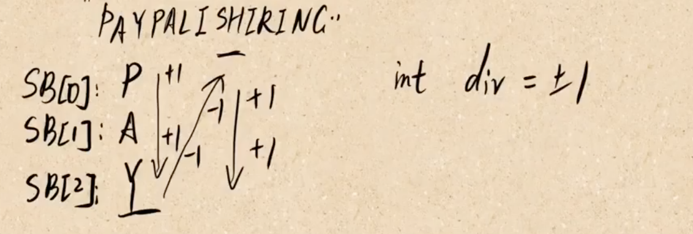

# 6.Z字形变换
将一个给定字符串根据给定的行数，以从上往下、从左到右进行 Z 字形排列。

比如输入字符串为 "LEETCODEISHIRING" 行数为 3 时，排列如下：
```
L   C   I   R
E T O E S I I G
E   D   H   N
```
之后，你的输出需要从左往右逐行读取，产生出一个新的字符串，比如："LCIRETOESIIGEDHN"。

思路：根据需要排列的行数，定义字符串数组，用来保存每一行的字符。遍历字符串，按照Z字形规律，更新数组中每行字符串，具体逻辑如下：


代码：
```java
class Solution {
    public String convert(String s, int numRows) {
        if (null == s || numRows == 1) return s;
        StringBuilder[] strs = new StringBuilder[numRows];
        for (int i = 0; i < numRows; i++) strs[i] = new StringBuilder();
        int dir = 1;
        int index = 0;
        for (char c : s.toCharArray()){
            strs[index].append(c);
            index += dir;
            if (index == 0 || index == numRows - 1){
                dir = -dir;
            }
        }
        StringBuilder result = new StringBuilder();
        for (int i = 0; i < numRows; i++) result.append(strs[i]);
        return result.toString();
    }
}
```